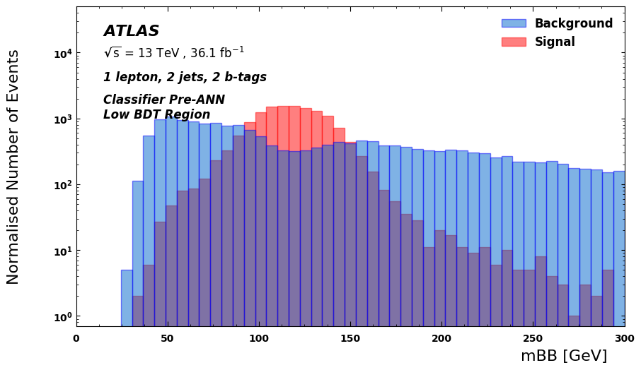

# Higgs ML (Higgs boson Machine Learning Classifiers)

## File Contents  
### [Adversarial Neural Networks](adversarial-nn-ml)  
- [dijetmassANN.py](adversarial-nn-ml/dijetmassANN.py) – Dijet-mass Aware Adversarial Neural Network Classifier
- [dijetmassANN_withmBBDistributionGraphs.py](adversarial-nn-ml/dijetmassANN_withmBBDistributionGraphs.py) – Dijet-mass Aware Adversarial Neural Network Classifier with Graphs
- [generatorANN.py](adversarial-nn-ml/generatorANN.py) – Monte Carlo Event Generator Aware Adversarial Neural Network Classifier
- [generatorANN_withmBBDistributionGraphs.py](adversarial-nn-ml/generatorANN_withmBBDistributionGraphs.py) – Monte Carlo Event Generator Aware Adversarial Neural Network Classifier with Graphs

## Summary of Results
### [Adversarial Neural Networks](adversarial-neural-network-ml)
#### Optimal Dijet Mass Aware Adversarial Neural Network Output Plots

#### Dijet Mass Aware Adversarial Neural Network: Without ANN vs. With ANN
&nbsp; | Low NN Output Region | High NN Output Region
:-------------------------:|:-------------------------:|:-------------------------:
Without ANN |  | 
With ANN  |  | 

- **Without ANN**: The Classifier is heavily dependent on the dijet mass variable, which can lead to inaccurate results.
- **With ANN**: The Classifier is much less dependent on the dijet mass variable, showing the Adversary in the ANN system has sucessfully suppressed the classifier's reliance on the dijet mass variable (and uses other kinematic variables instead to classify events as signal or background events).

